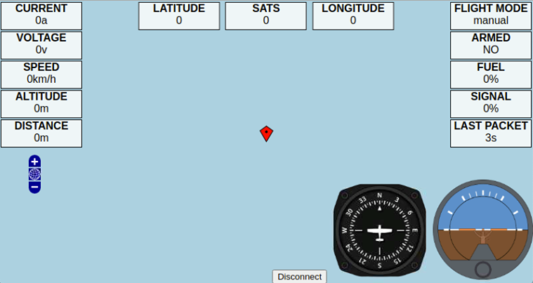

# Screen

# rpigs
Raspberry PI Ground Station for Smart Port, using ONLINE/OFFLINE maps from OSM

Im using:
- Raspberry Pi
- Display 800x480
- Bluetooth 4.0 (HM-10)
 
Bluetooth commands to make connection with FrSky Bluetooth module are: 
- AT+UUIDFFF0 
- AT+CHARFFF6 
- AT+ROLE1

For offline maps need to download TILES and import in folder "tiles/z/x/y.png"
